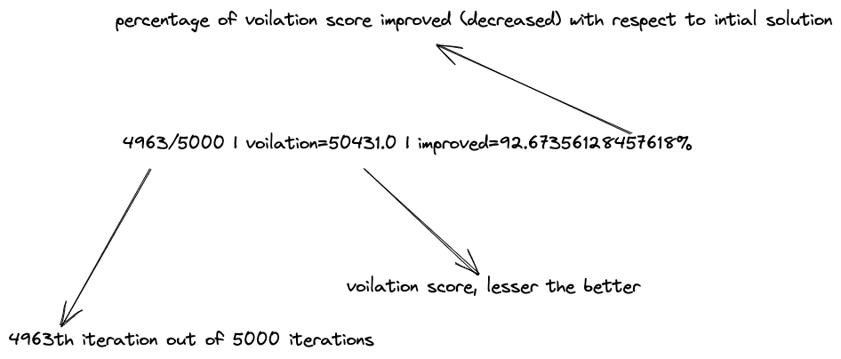

# DARP-Multi-CPU
Granular Tabu Search implementation of DARP for the single/multi CPU in Julia

## Steps to Run
1. Install julia

```
wget https://julialang-s3.julialang.org/bin/linux/x64/1.8/julia-1.8.1-linux-x86_64.tar.gz
tar zxvf julia-1.8.1-linux-x86_64.tar.gz
```
Now add the julia to path (in bashrc or zshrc file)
```
PATH='$PATH:<julia-extract-dir>/bin'
```

2. Run `julia julia_setup.jl`
3. chmod +x run_tests_adv.sh
4. Command to run tests

```
./run_tests_adv.sh <output-filename> <thread configurations to run>
```

Example
```
./run_tests_adv.sh benchmark1 20 16 14 12 10 8 4 2 1
```

## Breakdown of log line




## TODO
1. Diversification
2. Intensification
